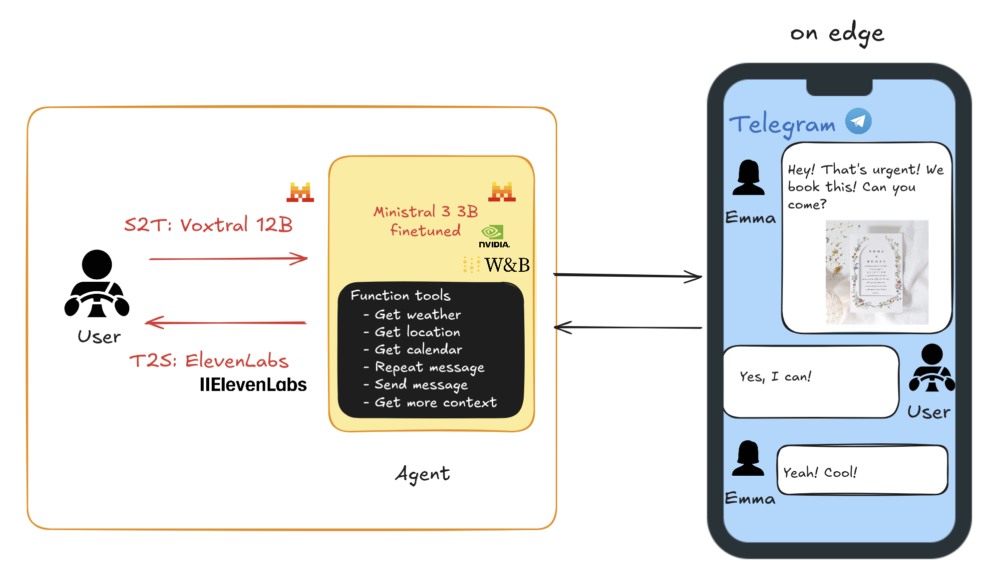

<div align="center">
  <h1>🐝 SupaClaw</h1>
  <p>Voice-first Telegram assistant designed for distracted users (like drivers). Powered by ElevenLabs, Voxtral, and a fine-tuned Ministral 3B, it reads incoming messages aloud, executes smart function calls (weather, calendar, location), and sends dictated replies on the go.</p>
</div>



Welcome! This project demonstrates how to run large language models (LLMs) on iOS and macOS devices using the **MLX Swift** framework. It serves as a practical guide through the process of integrating, adding, and running Hugging Face models on your device.

# About This Project

MLX Swift provides a framework for running machine learning models, including language models, on iOS, macOS, and other platforms. In this project, I’ve developed a sample app that utilizes MLX Swift to load and run LLMs and VLMs from Hugging Face. The app allows you to integrate custom models and test them in a real-world scenario.

# Blog Post Series

This project is part of a three-part blog series, where I walk you through the process of working with MLX Swift, from setting up the environment to adding and running custom models. Here are the blog posts in the series:

1. [MLX Swift: Run LLMs in iOS Apps](https://medium.com/@cetinibrahim/mlx-swift-run-llms-in-ios-apps-8f89c1123588) </br>
In this first post, I’ll guide you through setting up the MLX Swift environment and running large language models (LLMs) on iOS apps. We’ll develop a sample project and explore how to integrate these models for use in mobile applications.

2. [Run Hugging Face Models with MLX Swift](https://medium.com/@cetinibrahim/run-hugging-face-models-with-mlx-swift-d723437ff12e) </br>
The second post covers adding models from Hugging Face to MLX Swift. You’ll learn how to bring in custom language models and run them on your device.

4. [MLX Swift: Running VLMs (Image-to-Text) in iOS Apps](https://medium.com/@cetinibrahim/mlx-swift-run-vlms-image-to-text-in-ios-apps-ae34caa33c9b) </br>
In the final post, we’ll dive into using Visual Language Models (VLMs), exploring how to integrate image-to-text models into your app.

# Features

- Run LLMs and VLMs - Download and run LLMs and VLMs. The app is supporting both.
- Run Hugging Face Models – Load pre-trained models from Hugging Face and use them directly in your iOS or macOS app.
- Model Storage – Configure where your models are stored, either locally or on a custom directory.

# How to Get Started

1. Clone this repository to your local machine:
```bash
git clone https://github.com/ibrahimcetin/MLXSampleApp.git
```
2. Open the project in Xcode.
3. Follow the setup instructions in the first blog post to configure the environment and get started.

# Project Structure

There are only 3 files important:
- **ContentView.swift**: All UI code is here.
- **MLXViewModel**: All Business-logic is here.
- **ModelRegistry+custom.swift**: All defined custom models are here.

Each file is designed to keep the project easy to understand.

# Additional Resources

[My Medium](https://medium.com/@cetinibrahim)
[Hugging Face](https://huggingface.co/mlx-community)
[MLX Swift](https://github.com/ml-explore/mlx-swift)

# Voice I/O Setup (Remote STT/TTS)

The app now supports:
- STT via Mistral Audio Transcriptions (`voxtral-big-latest` by default)
- TTS via ElevenLabs Text-to-Speech

Configure these values in your local `.env` file (recommended), Xcode scheme environment variables, or app Info.plist keys:
- `MISTRAL_API_KEY` (required for STT)
- `MISTRAL_BASE_URL` (optional, default: `https://api.mistral.ai`)
- `MISTRAL_STT_MODEL` (optional, default: `voxtral-big-latest`)
- `ELEVENLABS_API_KEY` (required for TTS)
- `ELEVENLABS_VOICE_ID` (optional, default: `EXAVITQu4vr4xnSDxMaL`)
- `ELEVENLABS_MODEL_ID` (optional, default: `eleven_multilingual_v2`)
- Optional: `TEST_ENV_PATH` pointing to a dotenv file
- Optional: `HUGGINGFACE_TOKEN` (or `HF_TOKEN`) for private/gated Hugging Face models

Dotenv auto-loading:
- The app attempts to load `.env` automatically from current working directory.
- It also attempts to load `test.env` for backward compatibility.
- For iOS Simulator/app sandbox reliability, prefer setting `TEST_ENV_PATH` in scheme env vars.
- Start from `.env.example`, copy it to `.env`, and fill your real keys locally.

Usage in app:
- Tap mic button to record prompt audio, tap again to transcribe into the prompt field.
- Generate output as usual; response text is spoken progressively while it appears.

<div align="center">
  
</div>
